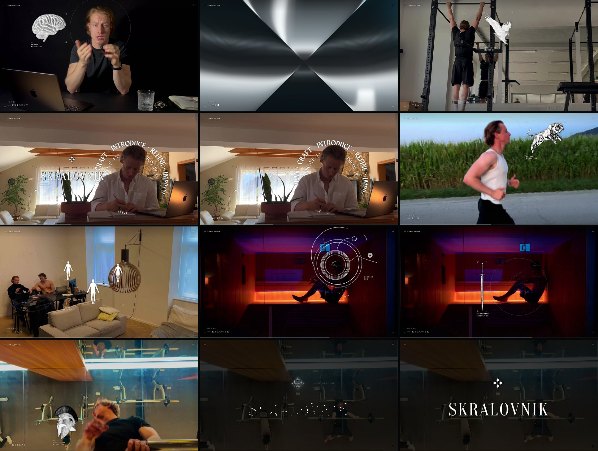

# Primer: SKRALOVNIK v3 (potrjeno 28. 9. 2026)

Referenčni rezultat skilla. Iz tega posnetka in datotek se v3 naredi znova, sličico za sličico
enako (preverjeno: vseh 303 sličic enakih, zvok bit za bit enak).

[](video/skralovnik-v3.mp4)

| Datoteka | Kaj je |
| --- | --- |
| `source.mp4` | originalni posnetek (4K, 30 fps, 8 kadrov, 242 sličic) |
| `track.json` | sledenje (okvir okoli subjekta in obris za vsako sličico), da MediaPipe ni potreben |
| `matte/` | maska osebe za 4. kader (obroč besed gre za Anžetom) |
| `video/skralovnik-v3.mp4` | master (1920×1080, 30 fps, AAC 320 kb/s) |
| `video/skralovnik-v3-web.mp4` | za splet (8 Mb/s) |
| `video/skralovnik-v3-sheet.jpg` | pregledna slika ključnih sličic |
| `sfx/round1/` | SFX krog 1: trije prototipi, audition reel, cue sheet, QC |
| `sfx/round2/` | SFX krog 2 (potrjen): družine različic, cue sheet v3, QC |
| `NEXT.md` | zapiski iz sej: ves feedback po krogih, odprte točke |

Datoteke filma (`film.json`, `events.ts`, `sfx-plan.json`) za v3 so privzete v predlogi skilla:
`.claude/skills/skralovnik-motion-edit/template/film/`.

## Ponovno narediti v3

```bash
cp -r .claude/skills/skralovnik-motion-edit/template /tmp/v3 && cd /tmp/v3
cp <repo>/examples/skralovnik-v3/{source.mp4,track.json} public/film/
cp -r <repo>/examples/skralovnik-v3/matte public/film/matte
npm install && pip install -r requirements.txt
scripts/render.sh skralovnik-v3      # → video/skralovnik-v3.mp4, -web.mp4, -sheet.jpg
```

Kadri, poglavja in rezultati:

| # | Poglavje | Prehod | Scan → rezultat | Dodatno |
| --- | --- | --- | --- | --- |
| 1 | Present | glitch trakovi (močan) | obraz → možgani `[MIND]` | beseda PRESENT |
| 2 | Build | negativ | prstan na roki → samo scan `[FOCUS]` | filmski trak |
| 3 | Train | krom iskrica | glava na drogu → orel `[STRENGTH]` | – |
| 4 | Build | 1-bit | obraz nad zvezkom → logo `[PLAN]` | obroč besed za njim, obris |
| 5 | Run | glitch trakovi | glava tekača → tiger `[SPEED]` | beseda RUN |
| 6 | Team | negativ | oba → trije ljudje `[TEAM]` | – |
| 7 | Recover | 1-bit | orbitalni HUD je scan, oko na glavi `[INSIGHT]` → meč `[SHARPEN]` | negativ |
| 8 | Repeat | krom iskrica | dvig → čelada `[DISCIPLINE]` | – |
| – | Outro | – | dan kot 1-bit kontaktna pola → krom iskrice → simbol → wordmark → ploščat logo | – |

Preverjanja: sinhronizacija 0 vzorcev, true peak −1,01 dBTP, največ 1 blisk na sekundo
(WCAG dovoli 3), 56 % sličic čistih.
